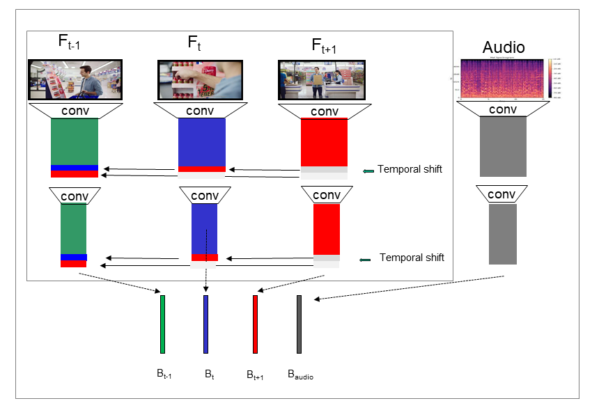

# Decoding Viewer Emotions in Video Ads

This repository offers access to the code and data necessary to replicate the findings of "Decoding Viewer Emotions in Video Ads: Predictive Insights through Deep Learning" by Alexey Antonov, Shravan Sampath Kumar, Jiefei Wei, William Headley, Orlando Wood, and Giovanni Montana.

## Paper Summary

Our study introduces a novel deep learning framework capable of predicting viewers' emotional reactions to video advertisements using short, 5-second excerpts. Leveraging a dataset derived from System1’s proprietary methodologies, encompassing over 30,000 video ads annotated by around 75 viewers each, our methodology integrates convolutional neural networks to process both video and audio data, achieving notable accuracy in identifying salient emotional excerpts.

### Methodology Summary

- **Emotional Jumps Detection**: From the initial pool of video ads, we identified significant emotional transitions, termed 'emotional jumps', utilizing viewer annotations to pinpoint moments of pronounced emotional shifts.
- **TSAM Architecture Development**: We developed the Temporal Shift Augmented Module (TSAM) architecture, a convolutional neural network model that integrates both video frames and audio signals to classify short video clips based on their emotional content.
- **Data Preparation and Model Training**: Utilizing the detected emotional jumps, we prepared a dataset of 5-second clips, each labeled with the corresponding emotion. This dataset was then used to train, validate, and test the TSAM model, demonstrating its ability to accurately classify the emotional content of unseen video clips.

### Dataset Breakdown 
The study utilized a total of 26,637 5-second video clips, divided into training, validation, and test sets as follows:

| Emotion    | Total | Train | Validation | Test |
|------------|-------|-------|------------|------|
| Anger      | 2,894 | 2,282 | 404        | 208  |
| Contempt   | 3,317 | 2,581 | 367        | 369  |
| Disgust    | 3,061 | 2,564 | 254        | 243  |
| Fear       | 3,166 | 2,549 | 317        | 300  |
| Happiness  | 3,577 | 2,918 | 383        | 276  |
| Natural    | 3,493 | 2,771 | 398        | 322  |
| Sadness    | 3,576 | 2,886 | 346        | 344  |
| Surprise   | 3,553 | 2,841 | 387        | 325  |
| **Total**  | **26,637** | **21,392** | **2,856** | **2,387** |

### Dataset and Network's weights Availabilty  
Given the dataset's substantial volume, both video excerpts and model weights are hosted externally. To access them for research purposes, contact Giovanni Montana at g.montana@warwick.ac.uk with your affiliation details. A download link will be provided.

## Repository Contents

- Python code for training the Temporal Shift Module (TSM) augmented neural network models detailed in the paper.
- A dataset consisting of 5-second video excerpts, totaling over 30,000 clips, utilized for training, validation, and testing, annotated for eight distinct emotional categories and their temporal onset.
- Pre-trained model weights facilitating the reproduction of reported experimental outcomes.

## Dataset Access Disclaimer

The dataset leverages System1's proprietary "Test Your Ad®" tool for public, educational, and illustrative use. The advertisements and excerpts, while derived from System1's tool, remain the property of their original owners. Usage beyond this study's scope requires explicit permission from those owners. By accessing the dataset, you agree to these conditions.

## Using the Code

The included Python code, leveraging the PyTorch framework, is well-documented and user-friendly. It allows for the reproduction of the paper's experiments or adaptation for your datasets.

In addition to training the TSM-augmented architectures described in our paper, this code also supports inference tasks.

Should you encounter issues or have questions, please open a GitHub issue on this repository.
