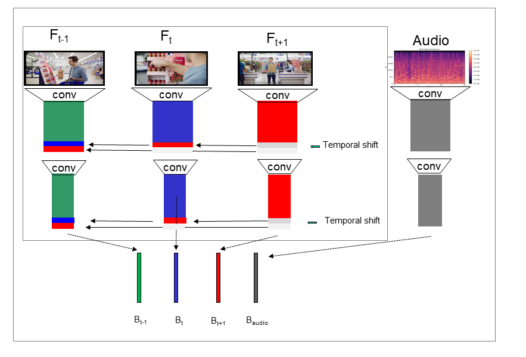

<h1 align="center">Decoding Viewer Emotions in Video Ads</h1>

<p align="center">
  
</p>

<p align="center">
  <a href="https://www.nature.com/articles/s41598-024-76968-9">Paper</a> &middot;
  <a href="https://huggingface.co/datasets/dnamodel/adcumen-viewer-emotions">Dataset & Weights</a>
</p>

Code and pre-trained model for ["Decoding Viewer Emotions in Video Ads"](https://www.nature.com/articles/s41598-024-76968-9) (Antonov et al., *Nature Scientific Reports*, 2024). The Temporal Shift Augmented Module (TSAM) predicts viewers' emotional reactions to video advertisements from short 5-second excerpts, processing both video frames and audio.

## Quick Start

### 1. Install dependencies

```bash
pip install -r requirements.txt
```

[ffmpeg](https://ffmpeg.org/download.html) is also required for preprocessing.

### 2. Download data and weights

```python
from huggingface_hub import snapshot_download

snapshot_download(
    repo_id="dnamodel/adcumen-viewer-emotions",
    repo_type="dataset",
    local_dir="./adcumen-data"
)
```

### 3. Preprocess

```bash
python setup_data.py --input ./adcumen-data --workers 8
```

This extracts video frames, audio, and model weights into the expected directory structure. Run `python setup_data.py --help` for all options.

### 4. Run inference

```bash
python predict.py \
    --data config/default.json \
    --model weights \
    --type test \
    --id test_run
```

Predictions are saved to `./data/predicted/test_run/`.

## Dataset

The dataset contains 26,635 five-second video clips from video advertisements, annotated for eight emotional categories:

| Emotion   | Total | Train  | Validation | Test  |
|-----------|-------|--------|------------|-------|
| Anger     | 2,894 | 2,282  | 404        | 208   |
| Contempt  | 3,317 | 2,581  | 367        | 369   |
| Disgust   | 3,061 | 2,564  | 254        | 243   |
| Fear      | 3,166 | 2,549  | 317        | 300   |
| Happiness | 3,577 | 2,918  | 383        | 276   |
| Neutral   | 3,491 | 2,771  | 398        | 322   |
| Sadness   | 3,576 | 2,886  | 346        | 344   |
| Surprise  | 3,553 | 2,841  | 387        | 325   |
| **Total** | **26,635** | **21,392** | **2,856** | **2,387** |

### Data on HuggingFace

**[huggingface.co/datasets/dnamodel/adcumen-viewer-emotions](https://huggingface.co/datasets/dnamodel/adcumen-viewer-emotions)**

Contents:
- `training.csv`, `validation.csv`, `testing.csv` -- dataset splits with columns: `Video_Name`, `Start_Second`, `Label`, `Clips_Name`
- `5-second_MP4_Clips.zip` -- the 26,635 five-second video clips (MP4)
- `backbone_weights.tar` -- TSAM model checkpoint (balanced accuracy)
- `tsam_weights.tar` -- TSAM model checkpoint (used by default for inference)

## Project Structure

```
.
├── setup_data.py              # Preprocesses HuggingFace download
├── predict.py                 # Run inference with trained model
├── train.py                   # Train TSAM model
├── config/
│   └── default.json           # Default config (relative paths)
├── lib/
│   ├── dataset/               # Data loading (video + audio)
│   ├── model/                 # TSAM architecture
│   └── utils/                 # Training utilities
├── mvlib/                     # Video processing library
├── DataAdcumen/               # Split files and VDB
├── requirements.txt
└── LICENCE
```

## Requirements

- Python 3.10+
- PyTorch 2.5+
- ffmpeg (system install required for both preprocessing and audio loading)
- CUDA-capable GPU (for inference)

See `requirements.txt` for Python packages.

## Training

```bash
python train.py \
    --config config/default.json \
    --cuda_ids 0 \
    --run_id my_experiment
```

## Dataset Access Disclaimer

The dataset leverages System1's proprietary "Test Your Ad" tool for public, educational, and illustrative use. The advertisements and excerpts, while derived from System1's tool, remain the property of their original owners. Usage beyond this study's scope requires explicit permission from those owners. By accessing the dataset, you agree to these conditions.

## License

The TSAM software and associated documentation are made available under a custom license that permits use solely for academic research and non-commercial evaluation. See [LICENCE](LICENCE) for full terms. For commercial use inquiries, contact Warwick Ventures at ventures@warwick.ac.uk.

## Citation

```bibtex
@article{antonov2024decoding,
  title={Decoding viewer emotions in video ads},
  author={Antonov, Alexey and Kumar, Shravan Sampath and Wei, Jiefei and Headley, William and Wood, Orlando and Montana, Giovanni},
  journal={Scientific Reports},
  volume={14},
  pages={25680},
  year={2024},
  publisher={Nature Publishing Group}
}
```

## Contact

For questions, suggestions, or collaborations, please contact Giovanni Montana at g.montana@warwick.ac.uk.
